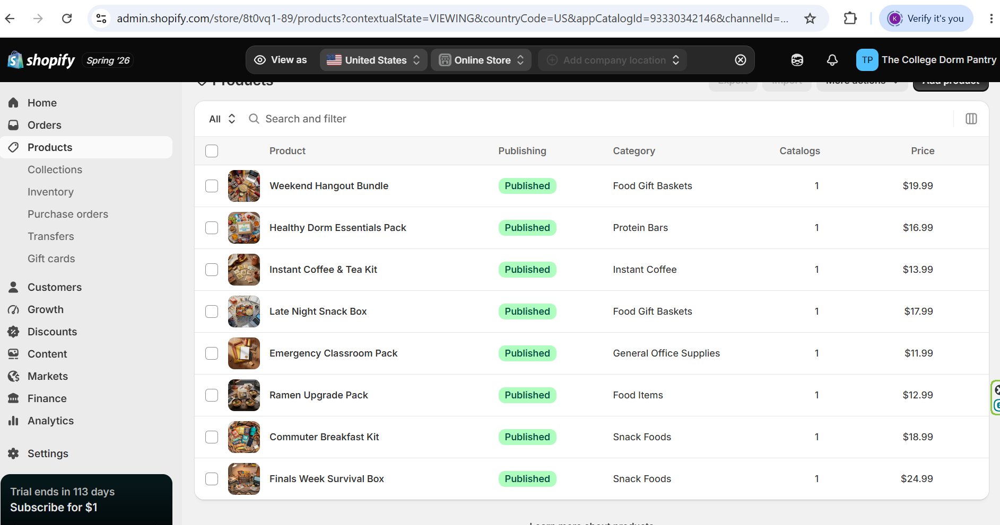

## 

1.  **Product list**\
    Weekend Hangout Bundle

    Healthy Dorm Essentials Pack

    Instant Coffee and Tea Kit

    Late Night Snack Box

    Emergency Classroom Pack

    Ramen Upgrade Pack

    Commuter Breakfast Kit

    Finals Week Survival Box

2.  **Product information evidence**\
    

3.  **Product description quality**

    \
    ***Weekend Hangout Bundle***

    ## The Ultimate Dorm Room Party Pack

    Friday night, no plans, just you and your friends crammed into a dorm room looking for something to snack on. The Weekend Hangout Bundle has everything you need to turn any ordinary night into a legendary hangout session.

    ### What's Inside:

    - Popcorn bags for the perfect movie night

    - Chips and pretzels for sharing (or not)

    - Dips and spreads to level up your snack game

    - Crackers and assorted munchies for the whole crew

    Whether it's a movie marathon, a game night, or just vibing with your roommates, this bundle brings the snacks so you can focus on the fun.

    ***Healthy Dorm Essentials Pack***

    ## Eat Well, Even in a Dorm

    Just because you're living on a meal plan doesn't mean healthy snacking has to go out the window. The Healthy Dorm Essentials Pack is curated for students who want to fuel their body and brain without sacrificing taste or convenience.

    ### What's Inside:

    - Protein bars to keep you full between classes

    - Trail mix with nuts, seeds, and dried fruit

    - Granola packets for a quick energy boost

    - Dried fruit snacks — naturally sweet and satisfying

    Whether you're rushing to class or grinding through a study session, these wholesome snacks keep you energized and focused all day long.

    ***Instant Coffee and Tea Kit***

    ## Your Morning Fuel, Sorted

    Rolling out of bed for an 8am lecture is hard enough — at least your morning drink shouldn't be. The Instant Coffee & Tea Kit brings the café experience right to your dorm room, no machine required. Just hot water and you're good to go.

    ### What's Inside:

    - Instant coffee packets for those early mornings

    - Assorted tea bags for a calming study session

    - Hot cocoa mix for cozy late nights

    - Sugar and creamer packets included

    Whether you're powering through a 7am alarm or winding down after a long day of classes, this kit has the perfect warm drink for every moment of dorm life.

    ***Late Night Snack Box***

    ## Fuel Your All-Nighter

    When the clock hits midnight and the studying isn't done, the Late Night Snack Box has your back. Packed with the ultimate dorm room munchies, this box is your go-to companion for those long nights when hunger strikes and the dining hall is long closed.

    ### What's Inside:

    - Chips & pretzels for that satisfying crunch

    - Cookies & candy for a sweet pick-me-up

    - Popcorn for stress-free snacking

    - Assorted treats to keep you going through the night

    Whether you're cramming for exams or binge-watching your favorite show, this snack box delivers the goods right to your dorm room.

    ***Emergency Classroom Pack***

    ## Never Get Caught Unprepared Again

    It's 7:58am, class starts in two minutes, and you just realized you have nothing to write with. Sound familiar? The Emergency Classroom Pack is your academic lifeline — everything you need to walk into any class, exam, or study session fully equipped and ready to go.

    ### What's Inside:

    - 1 notebook for all your lecture notes

    - 3 pens so you're never stuck without one

    - 2 highlighters to color-code your way to an A

    - 3 pencils for exams, sketches, and everything in between

    - 1 scantron because your professor definitely didn't hand those out

    Toss one in your backpack and forget about it — until the moment you need it most.

    ***Ramen Upgrade Pack***

    ## Because Plain Ramen Deserves Better

    You've got the noodles. But let's be honest — the flavor packet alone isn't cutting it anymore. The Ramen Upgrade Pack transforms your basic dorm staple into an actually satisfying meal, without any extra effort or a kitchen.

    ### What's Inside:

    - Savory toppings to add texture and flavor

    - Seasonings and spice blends to level up the broth

    - Easy add-ons that make every bowl feel like a real meal

    Whether it's a midnight snack or your third ramen of the week, this pack makes every bowl worth eating.

    ***Commuter Breakfast Kit***

    ## Breakfast That Keeps Up With You

    Early class, long commute, zero time to sit down and eat — the Commuter Breakfast Kit was built for exactly that. Grab it, go, and actually start your day with something in your stomach instead of just caffeine and regret.

    ### What's Inside:

    - Instant oatmeal for a warm, filling start to the morning

    - Microwavable egg bites for a quick protein boost

    - Instant coffee to get you out the door and into focus mode

    - Granola bars for snacking between classes

    - A drink to keep you hydrated on the go

    No dining hall, no problem. This kit makes sure you never skip the most important meal of the day again.

    ***Finals Week Survival Box***

    ## Survive Finals. One Snack at a Time.

    It's finals week. Your notes are everywhere, your sleep schedule is nonexistent, and the library has become your second home. The Finals Week Survival Box is packed with everything you need to power through the most stressful week of the semester without leaving your study spot.

    ### What's Inside:

    - Energizing snacks to keep your brain firing on all cylinders

    - Sweet treats for when you need a quick mood boost

    - Savory bites to hold you over between study sessions

    - Dorm-friendly foods that require zero prep time

    Because surviving finals isn't just about studying hard — it's about fueling smart.

4.  **Assortment strategy reflection**\
    The product assortment for my store is built around the everyday needs of college students. These college students includes students living on campus, commuting to campus, or trying to balance school, studying, and social life. Each bundle is designed to solve a specific student's problem like needing a quick breakfast option before class, snacks for late night studying, healthy dorm friendly foods, or classroom supplies for unexpected classroom needs. The products belong together because they are convenient, affordable, and easy to store while also being centered around student life. Bundling these items also makes the shopping experience easier by grouping related products into ready to make kits instead of requiring the outcomes to choose each item separately. This assortment supports the store concept by creating practical, student focused bundles that feel useful, relatable, and easy to purchase for different moments.

5.  **CPP Farm Store application reflection**\
    The CPP Farm Store should focus on making the shopping experience clear, convenient, and visually appealing for its customers. Product pages should include strong photos, simple descriptions, prices, bundle details, and clear stock inventory information so customer know exactly what they are buying. Since a lot of customer may be looking for groceries, quick snacks, gifts, or CPP grown goods, the store should organized products into categories that make shopping easy. One of these being the gift baskets. The website should also highlight what makes the farm store different than other local chains, make include its connection to local agriculture and its connection to Cal Poly Pomona. The farm store should present products in a way that makes online browsing easy while encouraging customers to visit the store and purchase their goods.

6.  **Appendix**

Github Repo: <https://github.com/lahumada63/ITP-Assignmnet-3>
